# Automatically Measure Plant Length Using Processing Techniques

## Supervised by [**___Atif Mansoor___**](https://research-repository.uwa.edu.au/en/persons/atif-mansoor)

## Introduction
At the beginning of 2022, our team was presented with the challenge of finding a
better way to measure plant lengths in a photograph by means of writing a software
application that leverages computer vision and image processing techniques.
Our client, the School of Molecular Sciences in UWA, had been studying the effects
of adding different nutrients to a certain type of plant to examine the effects on
their growth. To do so, the client would place a large number of small plants
on a glass plate, take a photo of the plate and then measure the length of each
plant with the use of a program called ImageJ. The use of the ImageJ software to
measure plant lengths was a very manual process that required clicking along the
length of each individual plant to obtain a length, a process that is time-consuming
and prone to error. Therefore, the project was given to our team to research a
faster, more accurate, and more time-efficient way to measure the plant lengths
by means of designing and building a software application.

It was decided that our team would use Python to build an application to process
the photographs by using the PlantCV library, a library of functionality that is
specifically used for the analysis of plants in images.
After some fine-tuning and after a number of issues around the complexities of
image processing were resolved, we were able to successfully process a photograph,
measure each plant, and output the results to the client with a high level of ac-
curacy.

In addition, we have created an additional data analysis application that allows
customers to analyze the generated CSV files in a timely manner. The application
can collect statistical information, visualize data information, and allow the client
to freely check the points in the visualization image and automatically generate
the data in the corresponding table.

## Expetiment Results
**[1] Initial Image**
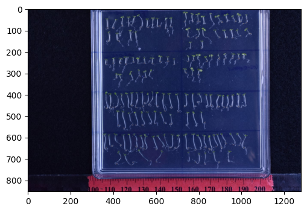
**[2] Resolve Method**
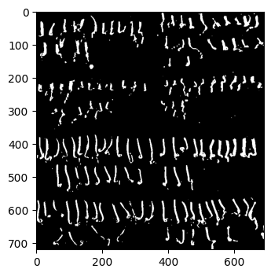
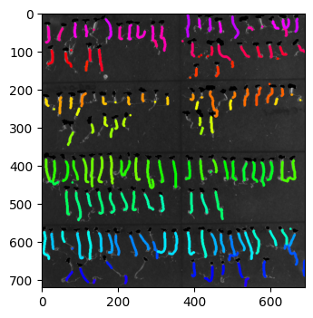
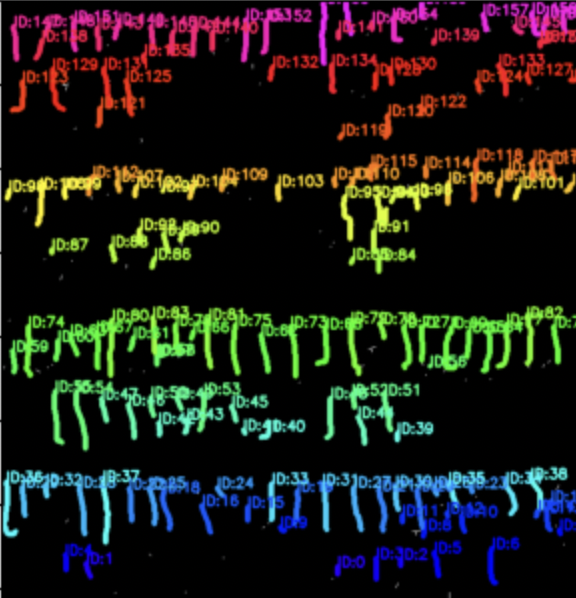
**[3] Test Function**

**_test1_**

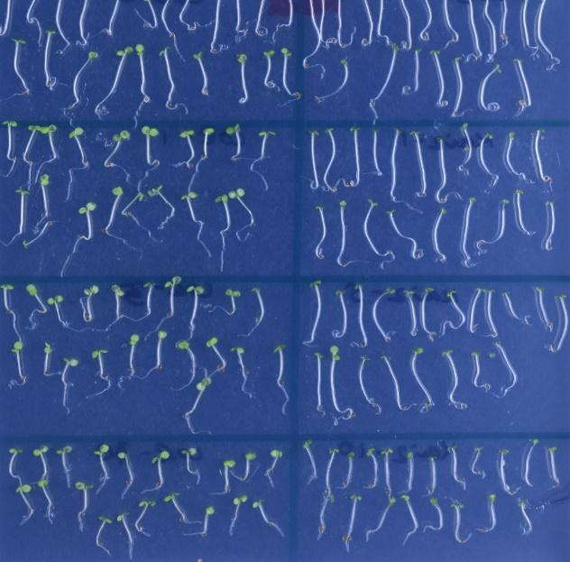
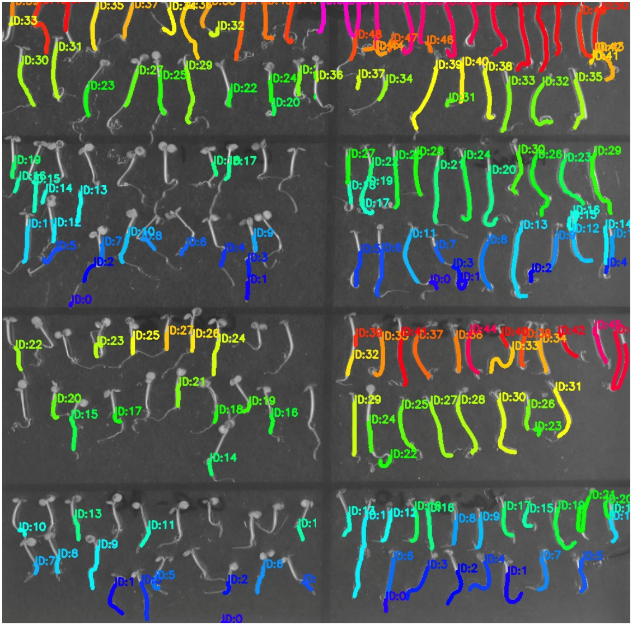
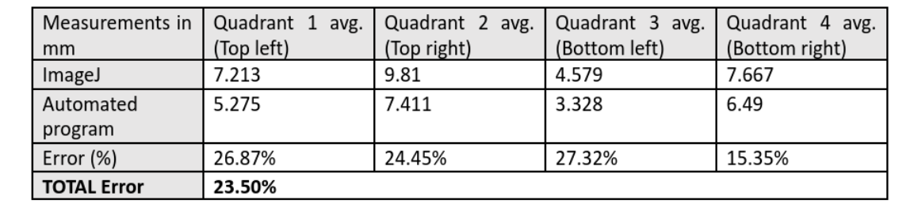
**_test2_**

*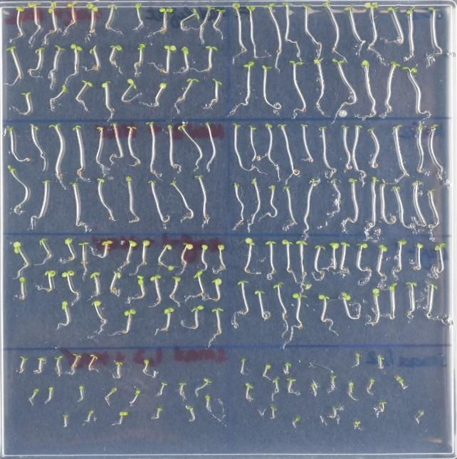
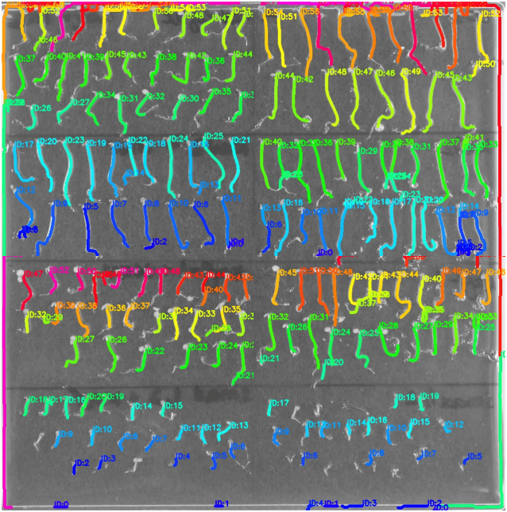
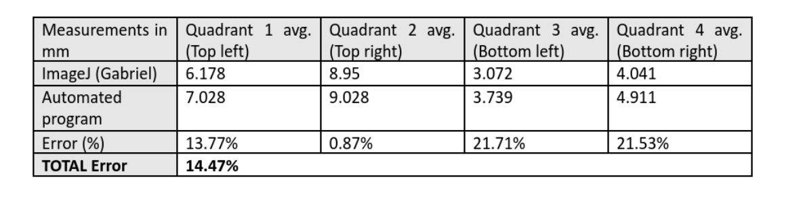
**_test3_**

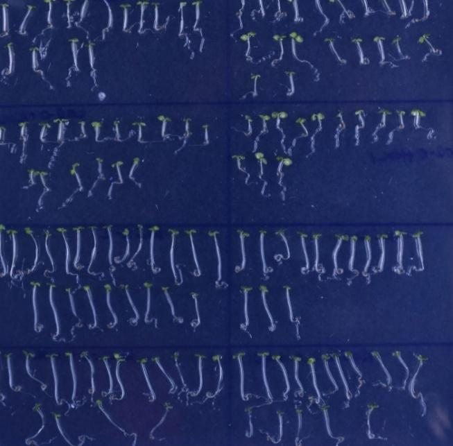
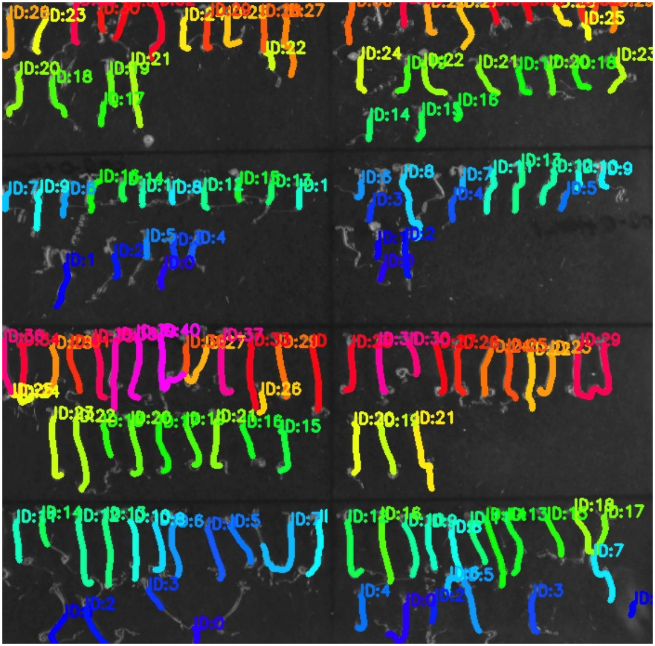
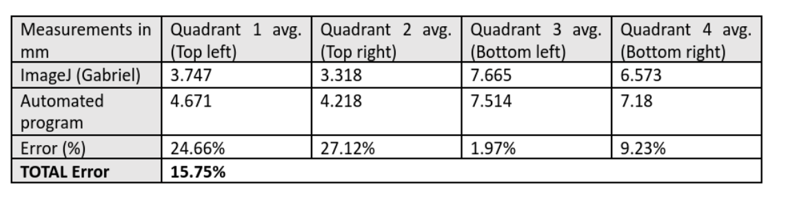

## Conclusion
Overall, the project had many positives and some negatives, which we all have
grown and learned from. By partaking in a large-scale project, our group was able
to take on responsibility for completing a system with actual purpose for the client.
We were able to explore fields of software engineering that many members lacked
previous experience in, such as computer vision techniques. Additionally, our
communication with the client was a positive experience, where frequent meetings
with the client guided our progress, while keeping the client aware of our progress
and results.

For parts we could improve upon in the future, some more individual proactiveness
and responsibility from all members could have pushed aspects of the project
forward. Often, certain aspects would be brought up on an as needed basis, rather
than being displayed in a proactive manner. While we were able to complete each
component successfully and work together on the project, some organizational
benefits would have presented themselves with some more forethought from all
members.

The client, Dr. Kamran, has been very invested in our project over the past year
and is interested in writing about our project with the hopes of publishing it in
the future. He had asked if any of us were willing to help him with his work on
our project, whether it’s helping him write his paper, or developing the program
further. I, and a few others, have agreed to help if he needed assistance.

## Author

**Ame Liu** _22910358@student.uwa.edu.au_

**Gabriel Nge** _22478142@student.uwa.edu.au_

**Jairus Wong** _21976567@student.uwa.edu.au_

**James Porter** _22493683@student.uwa.edu.au_

**Joris Guex** _22498809@student.uwa.edu.au_

**Joshua Radich** _22744833@student.uwa.edu.au_

**Vum Gualnam** _22355071@student.uwa.edu.au_
